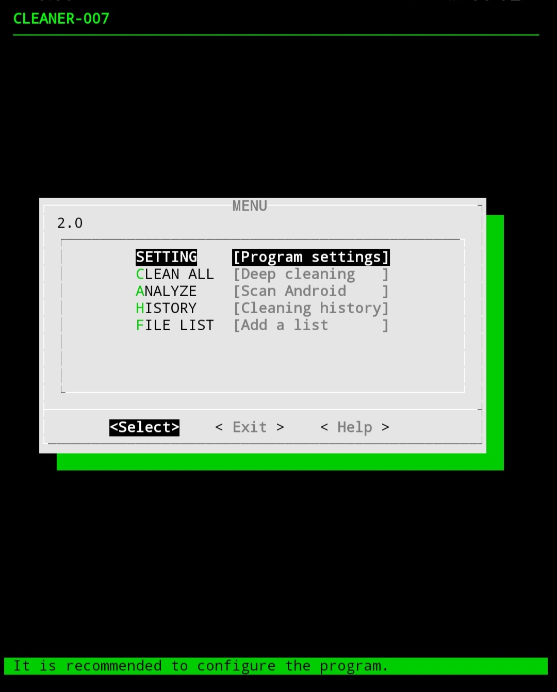
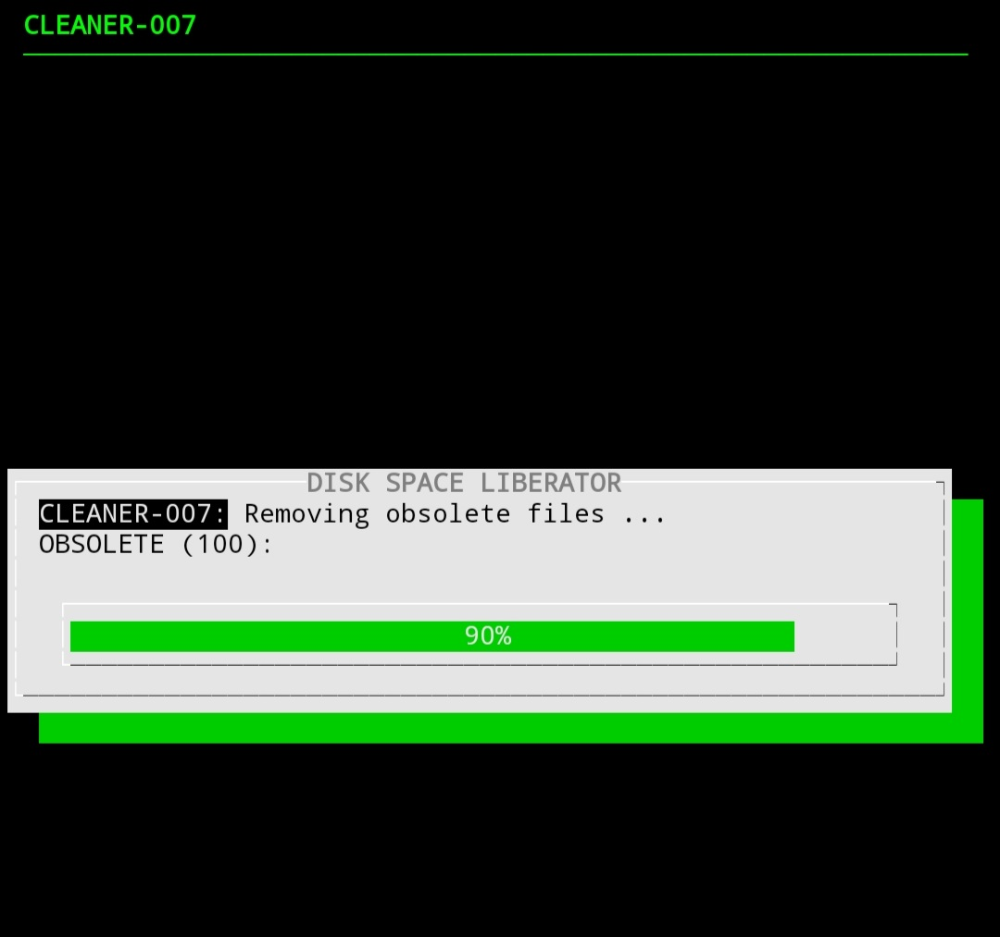

## Author : Z3R07-RED
## Version: 1.0

**Cleaner-007** : It is a tool to clean the junk or obsolete files and directories from the Android device.

REQUIREMENTS:
======
```bash
apt-get install dialog play-audio file -y
```

Once installed, you can continue to the next point.

```
git clone https://github.com/Z3R07-RED/Cleaner-007.git
```

USAGE:
======
* `cd Cleaner-007/`
* `chmod +x cleaner-007.sh`
* `./cleaner-007.sh`

<p align="center">

</p>

The tool has 2 cleaning modes:

* CLEAN ALL
* ANALYZE

<p align="center">

</p>
